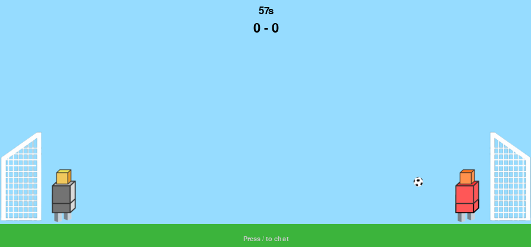

# <center>Game Server</center>
### <center>Multiplayer Football Game (2 player)</center>

<center>Django, Websocket, Redis</center>

# Game Details

The game needs 2 player to play it. Each match is played for 60 seconds. <br>



# How to Run?

## Directories
`App` contains the client module i.e. the game itself. Please download the portable version based on your operating system.

`game_server` contains the server module. Please follow the instruction below to setup the server on your own device.


## Server Setup

Please make sure your device has docker installed. Then run the following commands:

```
sudo docker-compose up -d
```

Then run the portable app on your device to play the game.


## Play from different devices.
Download the released version with `_online` suffix. These version uses hosted backend. So you can start playing online. Or instead, you can use `ngrok` to open public port from your device and rebuild the app by changing the URL. Server URL variable is in the `app/main.py` file.


### Build from source
Make sure you have `pyinstaller` installed. If not, you can install with `pip install pyinstaller` command.

#### Windows portable .exe
```
cd app
pyinstaller --onefile --windowed main.py
```

####
